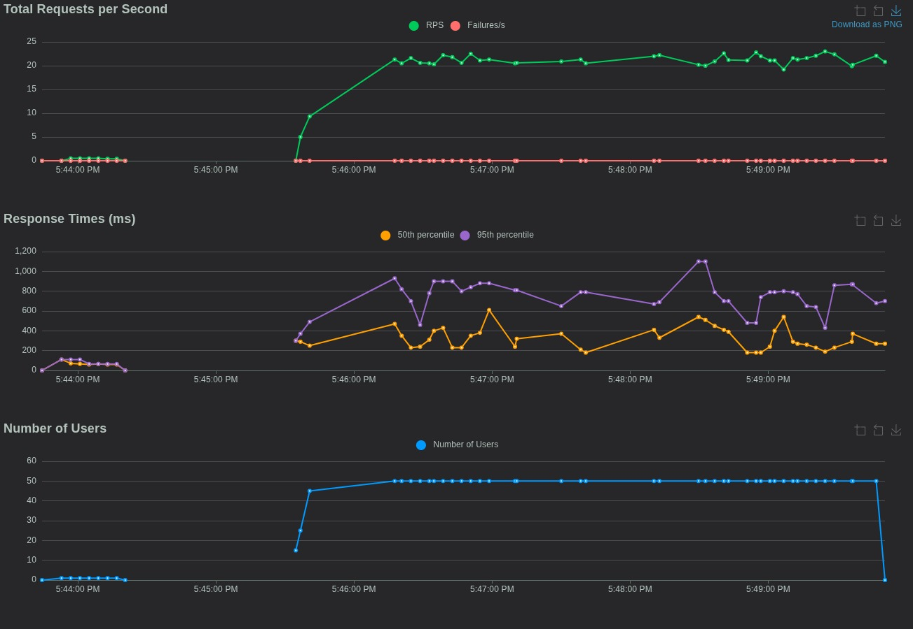
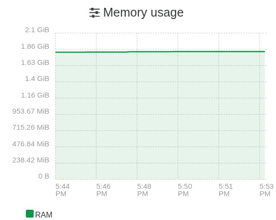
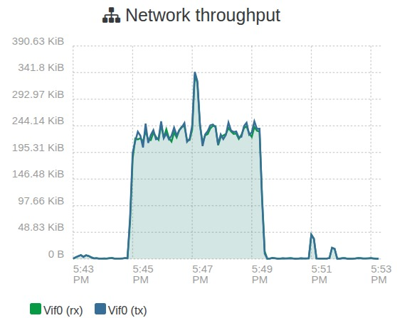

# Resultados da Avaliação Eficiência de Desempenho G-PE

Esta seção documenta a execução dos testes de carga e a análise do consumo de recursos computacionais, conforme planejado na Fase 2 GQM e detalhado na metodologia da Fase 4. O objetivo é verificar se o sistema MEPA mantém desempenho aceitável sob carga concorrente e identificar sinais de gargalo.

O teste foi executado no ambiente de homologação do MEPA. O host que hospedava a aplicação durante a execução possuía 2 vCPU e 2 GB de RAM.

## Configuração do Cenário de Teste

O teste de carga foi executado com a ferramenta Locust, simulando usuários concorrentes realizando requisições HTTP no endpoint monitorado. O monitoramento de infraestrutura foi acompanhado via Prometheus e Grafana.

* Cenário de carga Ramp up gradual até atingir 50 usuários simultâneos
* Janela de execução aproximadamente 4 minutos em platô com carga estabilizada
* Perfil de requisição GET no endpoint /api/monitoramento

Conceitos usados no Locust

* Number of users representa a concorrência alvo do teste, isto é, quantos usuários ficam ativos ao mesmo tempo
* Ramp up representa a velocidade de subida da carga, quantos usuários entram por segundo até chegar no total. Ramp up maior sobe mais rápido e tende a gerar mais pico, ramp up menor sobe mais suave e costuma ser melhor para observar estabilidade
* Plateau platô é o período em que o número de usuários já atingiu o alvo e se mantém estável. Essa é a janela mais confiável para julgar throughput e latência sem interferência da subida

Código utilizado no teste

```python
from locust import HttpUser, task, between

class MeuTeste(HttpUser):
    wait_time = between(1, 3)

    @task
    def listar_faturas(self):
        self.client.get("/api/monitoramento")
```

---

## Análise das Métricas e Evidências

A seguir são detalhados os resultados coletados para cada métrica definida no plano de testes, com base nos gráficos enviados.

### M-PE-01 Estabilidade do Throughput e M-PE-04 Escalabilidade

Objetivo verificar se o sistema mantém processamento estável sob carga e como o desempenho responde ao aumento de usuários.



*Figura 1 Painel do Locust com RPS tempos de resposta e número de usuários*

* Análise M-PE-01 Throughput durante o platô em torno de 50 usuários simultâneos o sistema sustentou aproximadamente 20 a 23 RPS e a série de Failures por segundo permaneceu próxima de zero, indicando estabilidade de vazão e ausência de falhas relevantes no período observado
* Análise M-PE-04 Escalabilidade o crescimento do RPS acompanhou a subida de usuários até formar um platô consistente, sugerindo que, até a carga testada, a aplicação absorveu o aumento de concorrência sem colapso de vazão. Ao mesmo tempo, como será mostrado nas métricas de CPU, o host operou próximo do limite, o que tende a restringir ganhos de escala em cargas maiores

### M-PE-02 Latência p95

Objetivo verificar se o tempo de resposta se mantém dentro de limites aceitáveis para a experiência do usuário.

Consultar Figura 1 no gráfico Response Times

* Resultado p50 mediana permaneceu em centenas de milissegundos durante boa parte do platô, variando ao longo do tempo
* Resultado p95 houve oscilação com picos próximos de 1100 ms, e na maior parte do tempo o p95 ficou abaixo de 1 segundo
* Conclusão considerando um critério de aceitação de p95 menor que 2 segundos, o sistema atendeu ao requisito com margem. Ainda assim, a variabilidade do p95 indica que existe pressão de recurso e que aumentos de carga podem elevar a cauda de latência

### M-PE-03 Saturação de Recursos CPU e RAM

Objetivo monitorar uso de infraestrutura para identificar gargalos ou falta de folga operacional.

#### Análise de CPU


*Figura 2 Consumo de CPU por núcleo durante o teste*

* Observação o núcleo Cpu1 operou muito próximo de 100 por cento por grande parte do período, enquanto o Cpu0 oscilou com picos e quedas
* Interpretação isso indica saturação de processamento e possível concentração de trabalho em um único núcleo, um padrão compatível com aumento de p95 e maior variabilidade quando a carga se mantém alta
* Resultado o pico observado supera o limite de 80 por cento definido como margem de segurança, caracterizando não conformidade para saturação de CPU

#### Análise de Memória RAM



*Figura 3 Consumo de memória RAM durante o teste*

* Observação o consumo permaneceu praticamente constante em torno de 1.7 GiB
* Resultado como o host possuía 2 GB de RAM, o uso ficou alto e com pouca folga operacional, o que aumenta risco de instabilidade e piora de latência sob picos ou cargas maiores

#### Evidências de Apoio Disco e Rede


*Figura 4 Taxa de transferência de disco*



*Figura 5 Taxa de transferência de rede*

* Análise complementar houve atividade frequente de escrita em disco durante a janela do teste e vazão de rede em patamar estável durante o platô. A combinação de CPU elevada com escrita recorrente em disco pode contribuir para oscilações do p95, pois aumenta competição por recursos em momentos de maior concorrência

---

## Matriz de Conformidade e Julgamento

| ID Métrica | Descrição             | Resultado Obtido                                                | Critério de Julgamento                      | Status                    |
| :--------- | :-------------------- | :-------------------------------------------------------------- | :------------------------------------------ | :------------------------ |
| M-PE-01    | Throughput estável    | ~22 RPS constantes e sem falhas relevantes                      | Manter-se estável sob carga                 | ✅ Conforme                |
| M-PE-02    | Latência p95          | Pico ~1.1 s e em geral abaixo de 1 s                            | p95 < 2 s                                   | ✅ Aceitável               |
| M-PE-03    | Saturação de recursos | CPU próxima de 100 por cento e RAM ~1.7 GiB em host 2 GB        | CPU < 80 por cento e RAM < 75 por cento     | ❌ Não conforme            |
| M-PE-04    | Escalabilidade        | RPS cresce com usuários até formar platô, mas com CPU no limite | Crescimento consistente sem pressão crítica | ✅ Aceitável com ressalvas |

## Conclusão da Fase 4 G-PE

No ambiente de homologação do MEPA, executando em um host com 2 vCPU e 2 GB de RAM, o sistema manteve vazão estável na faixa de 20 a 23 RPS e não apresentou falhas relevantes durante o platô com aproximadamente 50 usuários simultâneos. A latência p95 apresentou picos próximos de 1.1 s, permanecendo abaixo do limite de 2 s definido como critério de aceitação, o que indica experiência geral aceitável na carga testada.

Apesar disso, as métricas de infraestrutura mostram que a execução ocorreu com CPU em saturação e memória com pouca folga, o que caracteriza não conformidade para a métrica de saturação e sugere que a escalabilidade para além do patamar testado tende a ser limitada. A recomendação imediata é reduzir o gargalo de CPU e aumentar a folga de RAM, seja por otimização da aplicação e do caminho de requisição, seja por ajuste de recursos do host, antes de repetir testes em cargas maiores.
